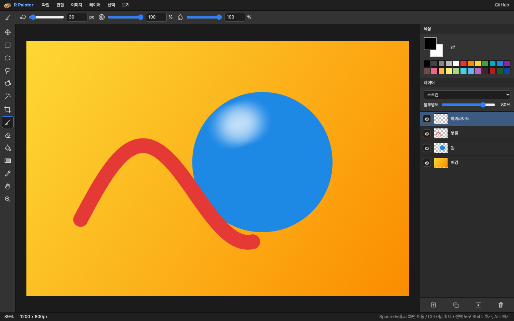
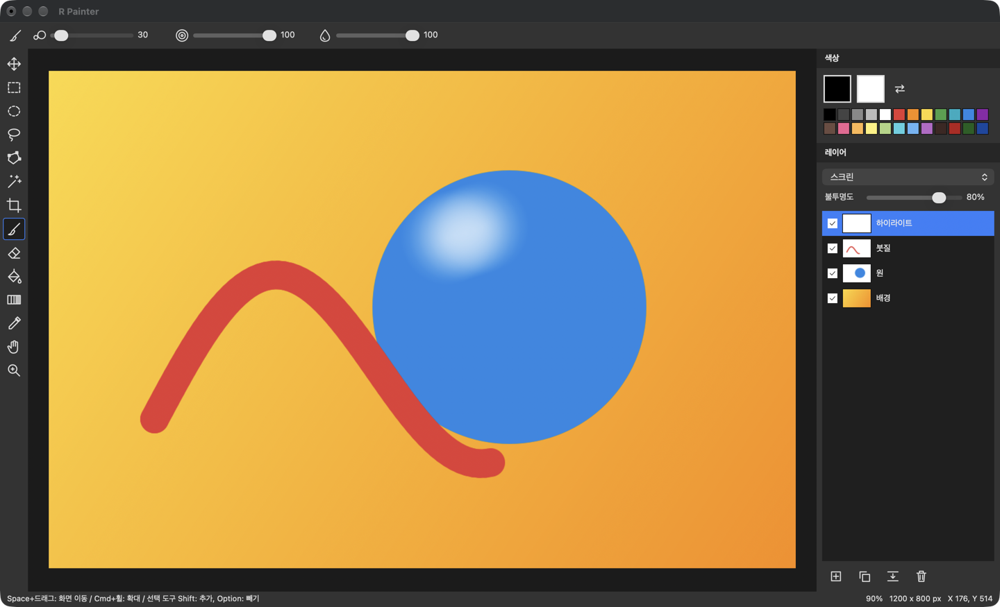
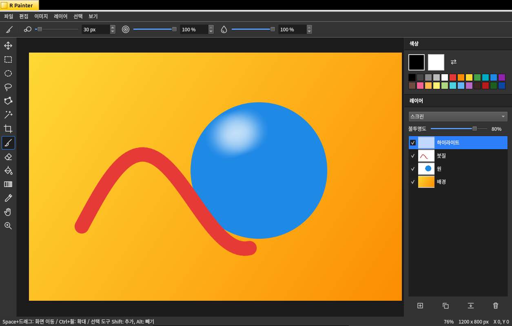
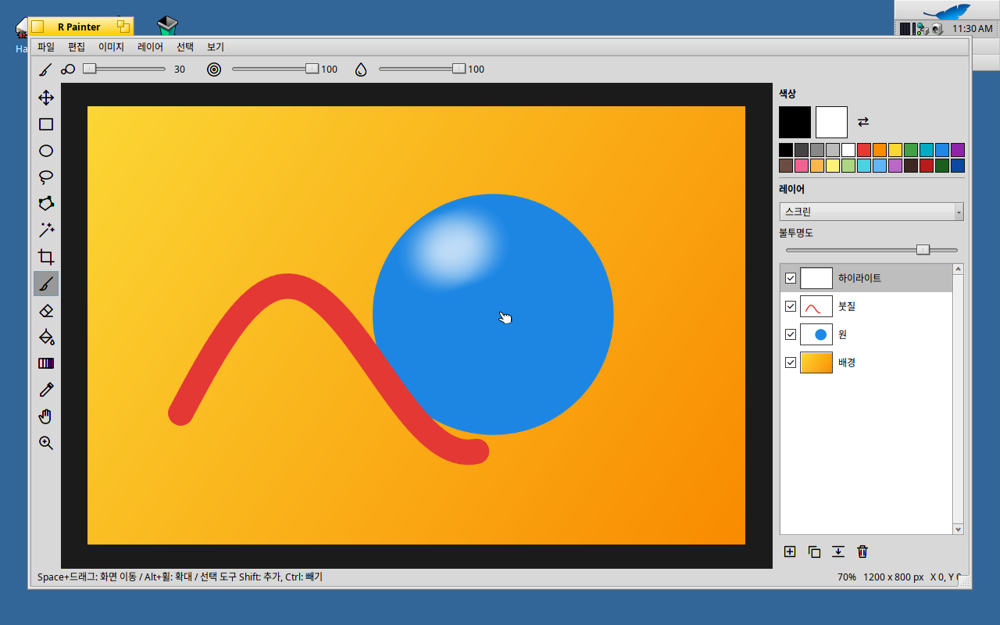

#  R Painter

レイヤーベースの画像エディターです。Web、macOS、Linux、RenkuOS (HaikuOS) で同じ機能が使えます。
表示言語はシステムの言語に従います (日本語、英語、韓国語、イタリア語、フランス語。それ以外は英語)。
文字を入れる機能はありません。

[English](README.md) · [Français](README.fr.md) · [Italiano](README.it.md) · 日本語 · [한국어](README.ko.md)

## 対応プラットフォーム

| 環境 | アーキテクチャ | インストール方法 |
|---|---|---|
| Web | 最新のブラウザー | インストール不要。ブラウザーで開きます |
| macOS 26 以降 | Apple Silicon (arm64) | アプリをダウンロードします |
| Linux: Debian、Ubuntu、Linux Mint | x86_64、arm64 | コマンド一つでビルドするか、ビルド済みファイルを使います |
| RenkuOS (RenkuOS (HaikuOS)OS) | x86_64、arm64 | pkgman.rainygirl.com のリポジトリから `pkgman` でインストールします |

## インストール

### Web



https://painter.coroke.net を開きます。

### macOS



1. [`r-painter-1.0.0-mac-arm64.dmg`](dist/r-painter-1.0.0-mac-arm64.dmg) をダウンロードします。
2. 開いて **R Painter** を **アプリケーション** フォルダにドラッグします。
3. アプリケーションから R Painter を開きます。

Apple Developer ID で署名していないため、初回は macOS にブロックされます。一度許可すれば済みます。

- 警告が出たあと、**システム設定 > プライバシーとセキュリティ** で *"R Painter" はブロックされました* の **このまま開く** をクリックします。
- またはターミナルで (*「壊れているため開けません」* と出る場合もこの方法です):

  ```sh
  /usr/bin/xattr -dr com.apple.quarantine "/Applications/R Painter.app"
  ```

### Linux



1. このプロジェクトを ZIP でダウンロードして展開するか、`git` で取得します。
2. そのフォルダでターミナルを開いて実行します。

   ```sh
   sudo apt install build-essential cmake qtbase5-dev qt5-image-formats-plugins
   ./linux/build.sh
   sudo cmake --install linux/build
   ```

   Qt 6 しかないディストリビューションでは、`qtbase5-dev qt5-image-formats-plugins` の代わりに `qt6-base-dev qt6-image-formats-plugins` をインストールします。
3. アプリケーションメニューから **R Painter** を開くか、ターミナルで `RPainter` を実行します。

Ubuntu 24.04 向けのビルド済みファイルもあります:
[x86_64](dist/r-painter-1.0.0-linux-x86_64.tar.gz), [arm64](dist/r-painter-1.0.0-linux-aarch64.tar.gz).
実行には Qt 6 ランタイム (`libqt6widgets6`) が必要です。

### RenkuOS (HaikuOS)



1. Terminal を開いて実行します。

   ```sh
   pkgman add-repo https://pkgman.rainygirl.com/$(getarch -p)
   pkgman install rpainter
   ```

   パッケージは x86_64 と arm64 向けに公開しており、`$(getarch -p)` が合うほうを選びます。32 ビットの RenkuOS (HaikuOS) (x86、x86_gcc2) には対応していません。リポジトリの追加は一度だけで済みます。
2. Deskbar の **Applications** メニューから **R Painter** を開きます。

自分でビルドする場合:

```sh
pkgman install gcc binutils make cmake haiku_devel
./haiku/build.sh
```

## ライセンス

MIT。[LICENSE](LICENSE) を参照してください。 RenkuOS (HaikuOS) 版には libwebp (BSD) と stb (パブリックドメイン) が含まれており、それぞれのライセンスは `haiku/third_party` にあります。

## AI 利用について

このプログラムの開発には Claude が活用されました。
